# VEC:
## Tu validación en un click

### 1. Resumen del proyecto
   
 VEC (Tu Validación en un Click) es el botón de validación de tarjetas de crédito en línea, es un sistema
     completamente seguro mediante el cual las entidades financieras brindan a los usuarios la posibilidad de
     realizar su validación de tarjeta Visa, MasterCard y AmericanExpress para la compra y/o pagos a través de 
     internet, de manera segura y confiada. 

      
   
 El sistema de VEC (Tu validación en un click) dispone de sus propios mecanismos de protección al comprador 
     y venderdor será un servicio de validación de tarjetas de crédito en línea para permitri que entidades
     privadas acepten validaciones de tarjetas de crédito de forma segura en línea. El servicio está vinculado a 
     los servicios de banca en línea de los usuarios, y las validaciones de tarjeta están vinculadas a la protección 
     de datos informáticos, que tienen un lugar en el manejo de leyes gubernamentales la cual se refiere a las normas
     de protección al consumidor. 

### 2. Fotos finales del proyecto
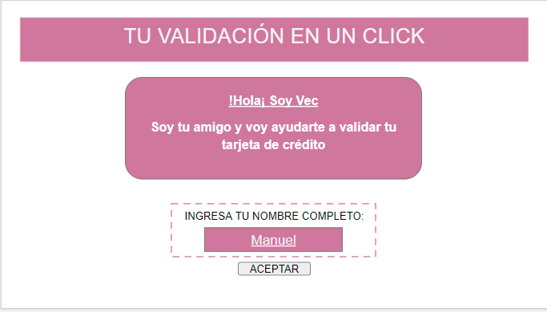 
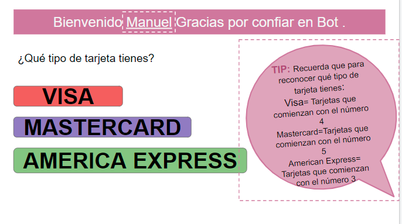 
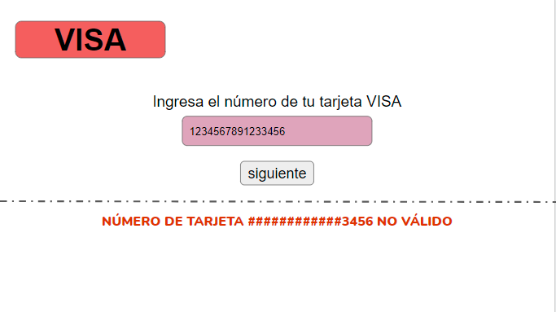 
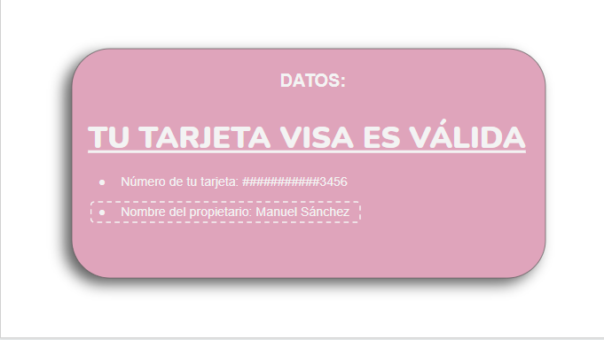 

### 3. Investigación UX:
 <h3> Explicar quiénes son los usuarios y los objetivos en relación con el producto:</h3>
  - Entidades financieras: VEC realiza la validación de tarjetas de crédito pro demido de instituciones financieras. Es necesario que la institución esté vinculada a VEC.  
  - Empresas: Estas usaran a VEC como validador de tarjetas de crédito por internet para facilitar la compra y/o pagos de sus clientes de manera segura  
  - Mayores de edad: Quienes compran y pagan sus servicios o produtos de los comercios, haciendo uso de sus tarjetas de crédito  

 <h3> Explicar cómo el producto soluciona los problemas/necesidades de dichos usuarios:</h3>
    El objetivo de VEC (Tu validación en un click) es que nuestros usuarios usen un sistema de validación de tarjetas de crédito para compras y pagos a través de internet, de forma segura y confiando en sus datos los cuales tienen sus propios mecanismos de protección de  la información  
  
 ### 4. Primer prototipo en papel
 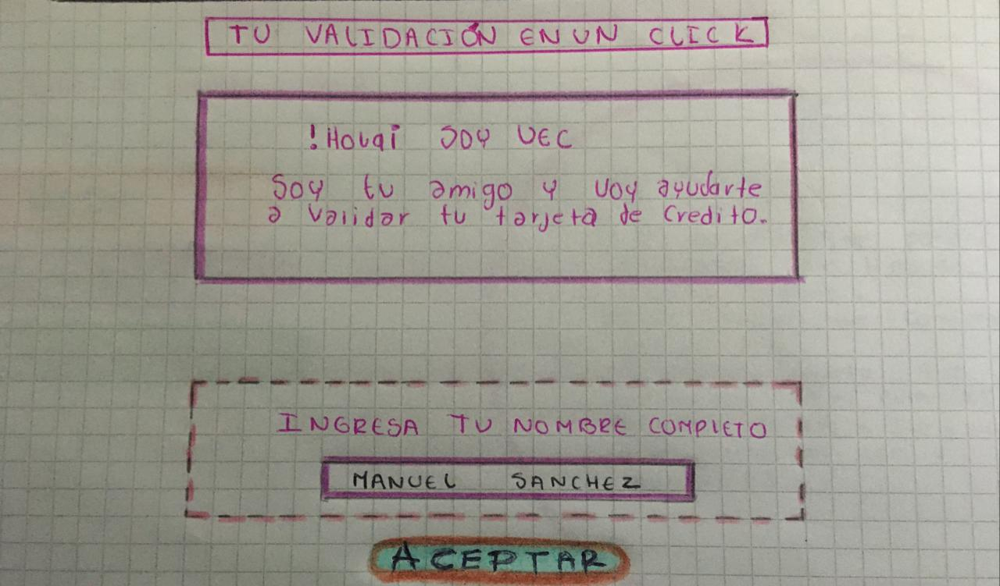 
 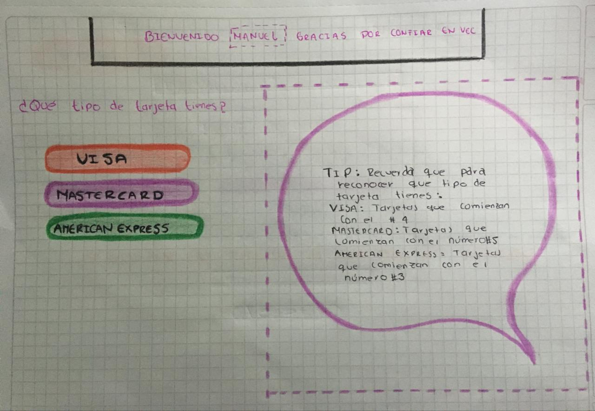 
 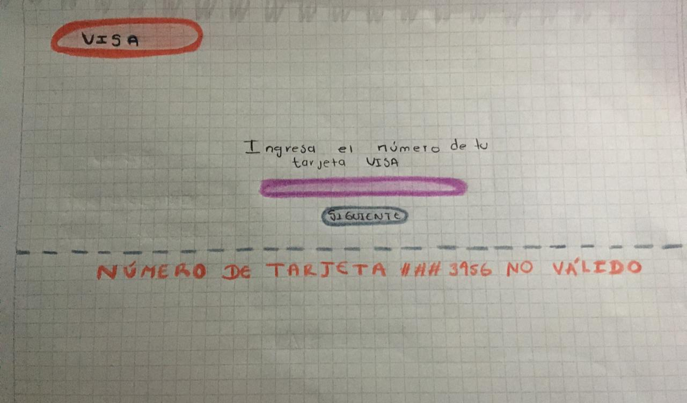 
 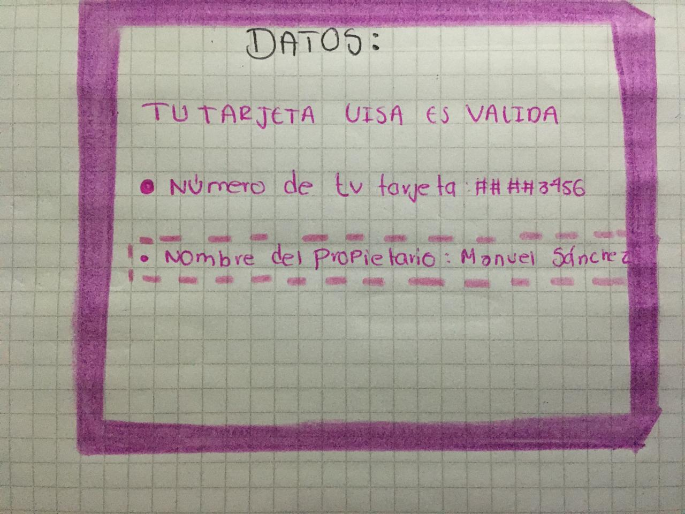  

 ### 5. Resumen del feedback recibido
 <h3> En el proceso del Feedback recibimos varias sugerencias para mejorar la interacción con el usuario y la  visualización del proyecto :  
1) En primera instancia  en la primera pagina se agrego información acerca de lo que se trataba VEC (Tu validación en un click ) para dar contexto al pedir el nombre. 
2) Se  mejoro  el resumen del proyecto  para enfocarnos en la interacción del usuario. 
3) Se decidió  no preguntar algunos datos adicionales al usuario ya que tendríamos que tomarlos desde el inicio de la página. 
4) También se tuvo en cuenta la paleta de colores ya que nos ayudó a orientarnos y elegir los colores apropiados para asociarlos a la respectiva página web. </h3>  

 ### 6. Imagen del prototipo final
 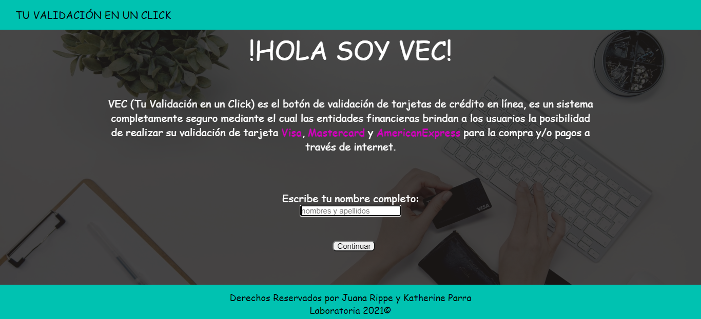 
 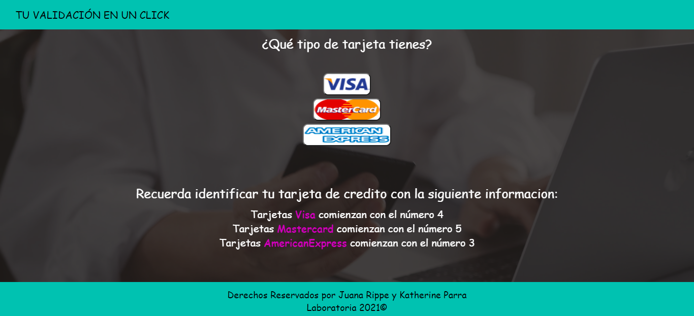 
 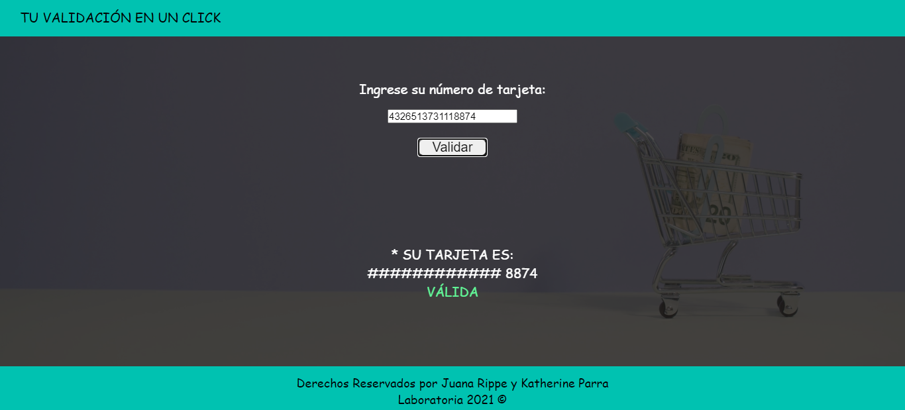 

